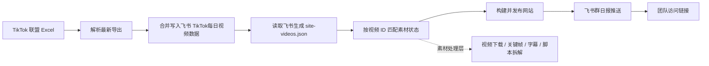

# TikTok 每日视频分析台生产链路

## 目标

把当前本地网站升级为团队可访问、每天自动更新、自动写入飞书表格并推送飞书群的生产链路。

第一阶段现在执行数据主链路：TikTok Excel 自动下载、最新日期新视频写入飞书、读取飞书生成网站、发布网站，并把网站和摘要推送到飞书群。视频真实下载、关键帧抽取、字幕和深度脚本拆解继续作为素材处理层单独推进。

## 当前项目状态

- 网站代码已经在本仓库中。
- 网站读取 `data/site-videos.json` 作为展示数据源。
- 已有 TikTok Excel 到网站数据的转换脚本：`scratch/export_tiktok_excel_to_site_data.mjs`。
- 已有飞书表格到网站数据的转换脚本：`scripts/import-feishu-sheet-to-site-data.mjs`。
- 已有 TikTok Excel 到飞书完整字段的同步脚本：`scripts/prepare-feishu-excel-data.py` 和 `scripts/sync-feishu-sheet-from-tiktok-report.mjs`。
- 已有 Sites 托管配置：`.openai/hosting.json`。
- 飞书表格将作为网站的主数据源，字段规范见 `docs/feishu-data-source.md`。

## 每日自动化闭环



## 步骤拆分

### 1. 数据输入

优先使用稳定来源作为每日输入：

- TikTok Shop 后台导出的 Excel，作为自动任务入口；每日默认只取导出文件里的最新日期
- 飞书表格 `TikTok每日视频数据`，作为网站主数据源
- 手动上传 Excel，作为临时兜底
- 后续可扩展为自动抓取 TikTok 页面、字幕和素材

飞书表格只处理 `2026-07-01` 及之后的视频数据。Excel 兜底文件需要保留到 `data/exports/`，便于追溯每一天的数据来源。

### 2. 数据标准化

执行飞书导入脚本，把表格整理为网站可读的 JSON：

```bash
npm run feishu:import
```

手动 Excel 兜底时执行：

```bash
node scratch/export_tiktok_excel_to_site_data.mjs <xlsx路径> data/site-videos.json
```

转换时需要确保：

- 同一个 `video_id` 不重复写入
- 指标字段保持数值类型
- 日期统一为 `YYYY-MM-DD`
- 每条记录保留来源文件和行号
- 榜单排序规则统一为：当天只要有任意视频成单，就先按成单数从高到低；当天全部无成单时，按播放/曝光从高到低

### 3. 素材补齐

当前网站只展示与同一视频 ID 匹配到的素材；没有匹配素材时显示待处理状态，避免复用其他视频画面。后续对重点视频继续补充：

- GIF 或视频预览
- 字幕文件
- 关键帧截图
- Hook、卖点、CTA 和复用结构

素材统一保存到 `public/videos/` 和 `public/keyframes/`，网站通过相对路径读取。

### 4. 飞书表格写入

每日流程中固定执行飞书表格写入：

- 新视频写入飞书
- 已存在视频按 `video_id` 或视频链接更新指标
- 每日默认只解析最新日期的新视频；每次写入前先读取飞书现有数据，避免最近 7 天导出覆盖掉 `2026-07-01` 以来旧数据
- 保留日期、达人、标题、链接、GMV、订单、曝光、点击率、互动等字段
- 写入成功后回读关键行数，确认没有重复或漏写

飞书应用密钥和 TikTok 报表访问凭据放在 GitHub Secrets 中，不把 token、secret、cookie 写入仓库。

### 5. 网站发布

当前项目已带 Sites 配置，可以发布为独立链接。生产发布有两种模式：

- 快速模式：每日数据更新后重新构建并发布网站。
- 稳定模式：把数据放入数据库或接口，网站自动读取最新数据，减少每日重新发布。

短期建议先用快速模式跑通闭环。

### 6. 飞书群推送

每日任务完成后，向指定飞书群发送摘要：

- 今日新增视频数
- Top 5 视频及核心指标
- 异常或缺失素材提醒
- 网站链接
- 飞书表格链接

如果任务失败，推送失败原因和失败步骤，避免静默中断。

### 7. 定时运行

不要依赖个人电脑长期开机。建议把任务放到：

- 公司服务器定时任务
- GitHub Actions 定时任务
- Cloudflare/云函数定时任务
- 公司内部自动化平台

当前 GitHub Actions 配置为北京时间每天 09:00 执行一次。网站部署成功后，会用“柯学的飞书 CLI”应用机器人向飞书群推送网站链接和当日摘要。

## 环境变量

生产环境至少需要这些配置，具体名称可按后续脚本统一：

- `LARK_APP_ID`
- `LARK_APP_SECRET`
- `FEISHU_SHEET_URL`
- `FEISHU_SPREADSHEET_TOKEN`
- `FEISHU_SHEET_ID`
- `TIKTOK_REPORT_URL`
- `TIKTOK_REPORT_COOKIE`
- `TIKTOK_REPORT_AUTHORIZATION`
- `LARK_TARGET_CHAT_ID`
- `LARK_TARGET_CHAT_NAME`，未配置时默认使用 `墨区小组`
- `SITE_PUBLIC_URL`
- `SITE_BACKUP_URL`

不要提交 `.env` 文件。

当前飞书内可打开版本：

- 妙搭应用 ID：`app_179t4tka49p`
- 妙搭访问链接：`https://xinchimcn.aiforce.cloud/app/app_179t4tka49p`
- 可见范围：飞书群 `墨区小组`
- 本地重新发布命令：`npm run miaoda:publish`
- 自动化边界：GitHub Actions 每天自动刷新飞书表格、`data/site-videos.json`、GitHub Pages 和飞书群消息；群消息主链接继续使用妙搭域名。妙搭 HTML 重新发布目前只能用 `--as user`，机器人无法直接发布。若要求妙搭链接每天云端自动实时更新，下一阶段需要改为妙搭全栈运行时读取飞书/站点数据，或为 CI 配置用户发布凭证。

飞书应用机器人需要加入目标群，并至少开通这些 IM 权限：

- `im:message`
- `im:chat:read`，仅当未配置 `LARK_TARGET_CHAT_ID`、需要按群名搜索时使用

## 验收标准

- 同事可以通过链接打开网站
- GitHub Pages 展示的是最新日期数据
- 妙搭链接在飞书内可打开；若使用静态 HTML 发布版，需要在数据更新后重新发布，或升级为全栈运行时读取数据
- 飞书表格每天自动新增或更新记录
- 飞书群每天收到摘要
- 飞书群消息主链接使用妙搭域名，备用链接使用 GitHub Pages
- 重复运行不会重复写入同一视频
- 任一步失败都会记录日志并推送提醒

## 建议的上线顺序

1. 把当前代码和链路文档保存到 GitHub。
2. 创建生产分支或保护 `main` 分支。
3. 配好每日输入文件位置和飞书表格地址。
4. 把已验证的飞书写表逻辑接入每日任务。
5. 发布网站并确认访问权限。
6. 配置飞书群定时推送。
7. 跑 3 天观察日志、重复写入和失败提醒。
